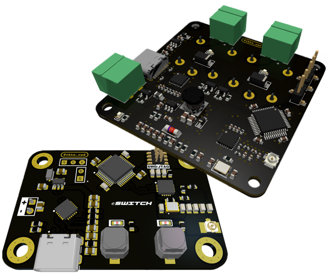

## eSYS24 - Overview

Electronic System based on 2.4GHz communication.  The Project is developed using the most popular GHz transceiver in the market, the [NRF24L01](https://www.mouser.com/datasheet/2/297/nRF24L01_Product_Specification_v2_0-9199.pdf), and controlled by [STM32F103Cx](https://www.st.com/resource/en/datasheet/stm32f103c8.pdf).

### Hardware
eSWITCH24 and eCONTROL24 schematic is in [hardware](/hardware). You can download PCB [Transceiver](/hardware/Transceiver/PCB_Files) and [Receiver](/hardware/Receiver/PCB_Files) designs files to build your eSYSTEM fully. If you'll fabricate the boards, I recommend use the [JLC7628 Stackup](https://cart.jlcpcb.com/impedance?_ga=2.116811712.798095935.1647969093-664896489.1639745533) from JLCPCB.

### Firmware
Both Codes were written in the Arduino IDE. The Codes and the libs are available to download [here](/firmware).

### Images
Some pictures are available in this file to create a Spoiler of the project.

